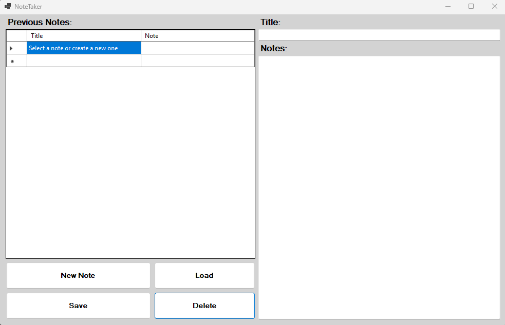
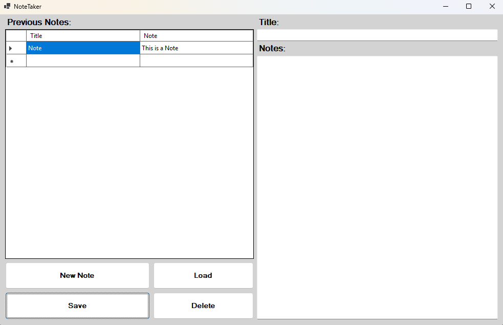
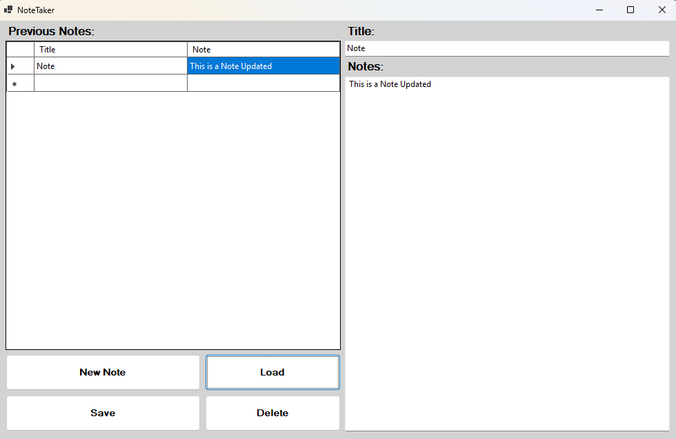
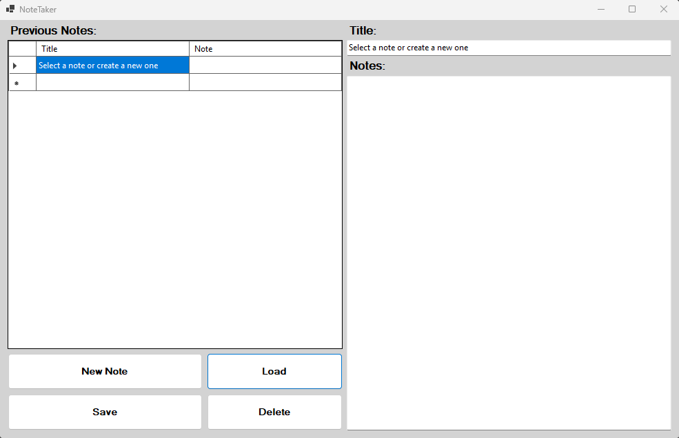

# Note Taking Application in C#

# Overview:

The Note Taking Application is a Windows Forms application that is developed in C# allowing users to manage their notes efficiently. This application provides a user-friendly interface to take, edit, delete, and save notes that role over from session to session. The notes are stored persistently in a text file, "notes.txt", ensuring data retention between sessions. The application leverages a DataTable to dynamically manage note entries, offering efficient data handling and a user-friendly focused display. This application was designed for individuals who need a simple yet effective way to manage their notes. The application leverages and integrates data handling and user interaction features, making note management seamless and efficient.

# Features:
-	Quickly create new notes, allowing the user to enter a title and note content; or allowing the user to enter one or the other.
-	Load previously saved notes, either entered from the current session, or from previous sessions, make changes, and save them back.
-	With the single press of a button, remove any notes you no longer need.
-	All notes are saved in a separate file "notes.txt" allowing for continuity across sessions.
-	The note taking application was built with a user-friendly, straightforward, easy-to-navigate interface allowing the user to manage notes efficiently.

# Current Finished Product Images:

### 1. Application Startup Screen 

### 2. Adding a New Note 

### 3. Loading and Updating the Previous Note 

### 4. Main Menu After Deleting a Note 

## Technologies Used:
-	C#
-	.NET Framework (Windows Forms)
-	System.IO (for file handling)

# Usage Instructions:

# File Pathway Tree/ File Directory:

\NoteTakingApplication\
| --- Program.cs\
| --- NoteTakingApplication.csproj\
| --- NoteTakingApplication.sln\
| --- Form1.resx\
| --- Form1.cs\
| --- Form1.Designer.cs

## Installation & Setup:
1.	First, clone/save the repository to your local machine. Then ensure you have a C# supporting IDE, (Such as Visual Studio Community 2022).
2.	Open the project folder in the C# supported IDE, then since there are no additional downloads/libraries required; just compile and run the “Program.cs” file directly.

## How It Works:
-	All notes are automatically saved and loaded from "notes.txt”. This helps with data persistence and allows the notes a user enters to be saved and reloaded between sessions. Automatically populating notes from the "notes.txt" file when the application starts.
-	### User Interface/Buttons:
1.	Adding Notes / “New Note button”: Titles and contents are added to the DataTable and saved in "notes.txt". Click "New Note" to clear fields and enter a new note.
2.	“Load Note button”: Select a note from the list and click "Load" to view or edit.
3.	“Delete Note button”: Removes selected notes from both the interface and "notes.txt” file. Select a note and click the "Delete button" to remove it.
4.	“Save Note button”: Enter a title and note content, or just one out of the two, either a title or note content; then click "Save" to store the note.

# Contributing to the Codebase:
Contributions are welcome! Feel free to work on and fork the repository, make changes or add new features, and submit a pull request. Improvements, bug fixes, and suggestions are greatly appreciated to enrich the user experience and functionality.
